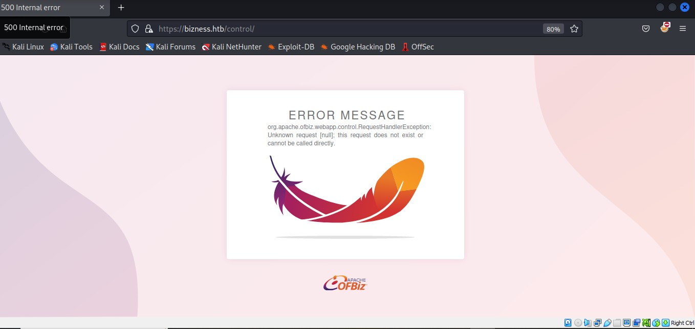
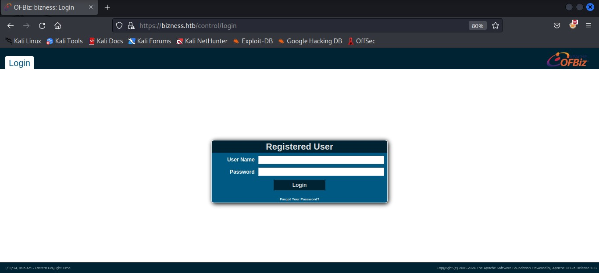

## SUMMARY

> This is a retired easy Windows machine on HTB which involves exploiting vulnerabilities in SMB shares and Group Policy Preferences (GPP) encryption to gain initial access. The challenge progresses with a Kerberoasting attack to obtain credentials, ultimately leading to privileged access as the Administrator.

```sh

```





**blog**

> hfioshhsg